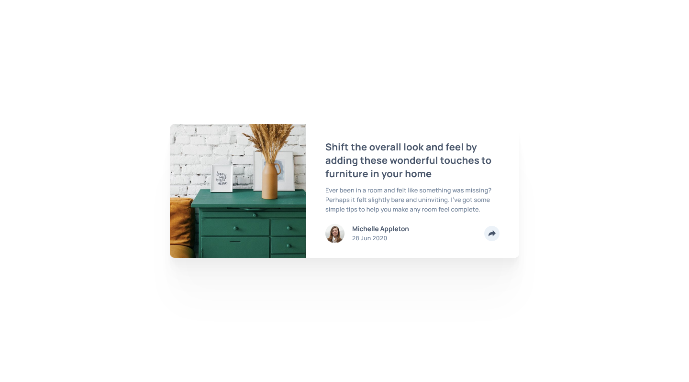

# Frontend Mentor - Article preview component solution

This is a solution to the [Article preview component challenge on Frontend Mentor](https://www.frontendmentor.io/challenges/article-preview-component-dYBN_pYFT). Frontend Mentor challenges help you improve your coding skills by building realistic projects. 

## Table of contents

- [Overview](#overview)
  - [The challenge](#the-challenge)
  - [Screenshot](#screenshot)
  - [Links](#links)
- [My process](#my-process)
  - [Built with](#built-with)
  - [What I learned](#what-i-learned)
  - [Continued development](#continued-development)
  - [Useful resources](#useful-resources)
- [Author](#author)
- [Acknowledgments](#acknowledgments)

## Overview

### The challenge

Users should be able to:

- View the optimal layout for the component depending on their device's screen size
- See the social media share links when they click the share icon

### Screenshot



### Links

- Solution URL: [Solution at Frontend Mentor](https://www.frontendmentor.io/solutions/article-preview-component-with-tool-tip-using-javascript-hOb9pVopR_)
- Live Site URL: [Article Preview Component](https://jaycgreenwald.github.io/12-article-preview-component/)

## My process

Beginning with mobile, I styled the layout only (no tool tip/JS). Then I styled the active states. Still no JavaScript. Then, I wrote the JS to make it functional.

### Built with

- Semantic HTML5 markup
- CSS custom properties
- Flexbox
- CSS Grid
- Mobile-first workflow
- JavaScript

### What I learned

For the second time now, I used the trick of hiding a checkbox which can be clicked to display new or additional content. I learned how to create the triangle at the bottom of the tool tip too. For the JS I had to learn how to add event listeners for the checkbox. This project stretched my coding skills.

To see how you can add code snippets, see below:

```css
.preview__social::after {
        content: '';
        position: absolute;
        left: calc(50% - 12px);
        top: 100%;
        border: 12px solid var(--grayish-blue);
        border-color: var(--very-dark-grayish-blue) transparent transparent transparent;
    }
```

### Continued development

I need to continue to learn about accessibility, organizing my css into multiple files, and JavaScript.

### Useful resources

- [The “Checkbox Hack” (and things you can do with it) ](https://css-tricks.com/the-checkbox-hack/) - How to do use the hidden checkbox. I used them with the FAQ Accordion project, but I needed a refresher.
- [Inclusively Hiding & Styling Checkboxes and Radio Buttons](https://www.sarasoueidan.com/blog/inclusively-hiding-and-styling-checkboxes-and-radio-buttons/) - This article gives me the chance to read up on how best to implement the hidden checkbox hack.

## Author

- GitHub - [@jaycgreenwald](https://github.com/jaycgreenwald)
- Frontend Mentor - [@jaycgreenwald](https://www.frontendmentor.io/profile/jaycgreenwald)
- Twitter - [@jaycgreenwald](https://www.twitter.com/jaycgreenwald)

## Acknowledgments

Frontend Mentor Slack, my accountability group, and a wellspring of online information created by coders. Thank you!